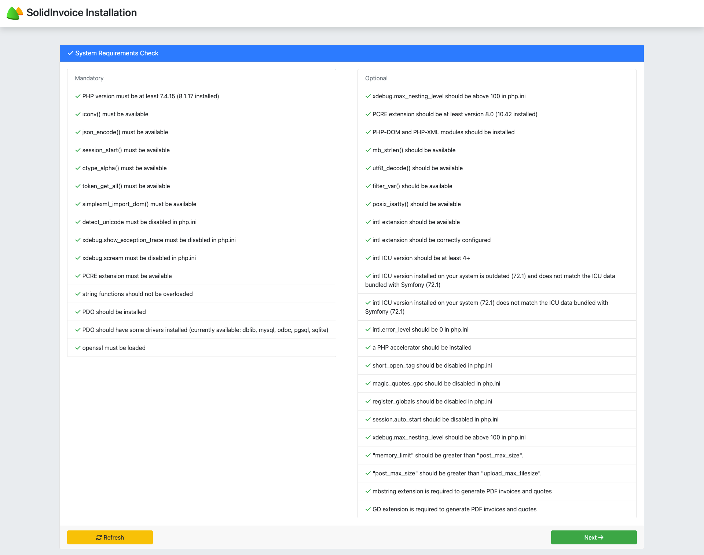

# System Installation

When navigating to the application for the first time, you will automatically land on the installation page.

This page will show if your system meets all the requirements in order to run SolidInvoice. If your system does not meet the requirements, an error message will advise you what you need to change in order to meet the requirements. After you have fixed any issues, refresh the page by either pressing `F5` or hitting the `Refresh` button.

If there are no errors, you can proceed by pressing the `Next` button.

<figure><figcaption></figcaption></figure>

### Configuration[¶](/broken/pages/BwG6LjqLYTBbe7ofGdDZ)

This step allows you to set up your database where all information will be stored.

#### Database Configuration[¶](/broken/pages/BwG6LjqLYTBbe7ofGdDZ)

Add your database information. If the database doesn’t exist, SolidInvoice will attempt to create it.

<figure><figcaption></figcaption></figure>

### Installation Process[¶](/broken/pages/BwG6LjqLYTBbe7ofGdDZ)

At this point, the database will be installed and all your tables will be created.

When the installation is complete and there are no errors, you can continue with the setup process by pressing on the `Next` button.

<figure><figcaption></figcaption></figure>

### System Information[¶](/broken/pages/BwG6LjqLYTBbe7ofGdDZ)

The final step is to configure your application and create your first admin user.

<figure><figcaption></figcaption></figure>

The following values needs to be configured:

| Locale:   | 
Note

The Locale determines the language to use and is also used for currency and number formatting. So be sure to choose the correct locale for your country.

<strong>Note:</strong>

Only the <code>English</code> language is supported at the moment, but support for other languages may be added in a future release.
 |
| --------- | --------------------------------------------------------------------------------------------------------------------------------------------------------------------------------------------------------------------------------------------------------------------------------------------------------------------------------------------------------- |
| Currency: |                                                                                                                                                                                                                                                                                                                                                           |

When you are done, continue by pressing the `Next` button.

#### Admin User[¶](/broken/pages/BwG6LjqLYTBbe7ofGdDZ)

You need to create an admin user. The provided details will be the credentials you use to log into the system.

### Final Steps[¶](/broken/pages/BwG6LjqLYTBbe7ofGdDZ)

After the setup process is complete, the last step is to set up the Cron job.

The Cron job is used to run scheduled tasks like recurring invoices. Setting up the cron job will be different based on your hosting provider. Please consult your hosting provider for the proper way to set up the cron job.


#### Warning

If you do not set up the cron job, functionality will be limited, and scheduled tasks won’t be able to run. It is **highly** recommended to set up the cron job.


When you are done and ready to use the application, press the `Log in now` button to log into the application. 

<figure><figcaption></figcaption></figure>
